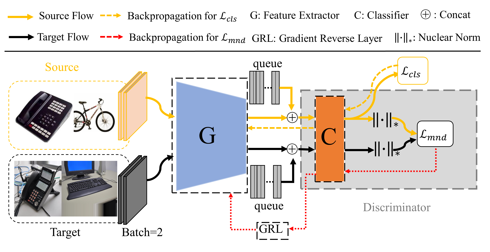

# ICME2024 - Multi-batch Nuclear-norm Adversarial Network for Unsupervised Domain Adaptation


# MBAN 

This repo is the official PyTorch implementation of "Multi-batch Nuclear-norm Adversarial Network for Unsupervised Domain Adaptation".

<div align=center></div>

## Abstract

Adversarial learning has achieved great success for unsupervised domain adaptation (UDA). Existing adversarial UDA methods leverage the predicted discriminative information with Nuclear-norm Wasserstein discrepancy for feature alignment. However, the limited memory space makes it very difficult to accurately calculate the Nuclear-norm, which hinders domain adaptation. To address this challenge, we propose the multi-batch Nuclear-norm adversarial network, termed as MBAN. Specifically, we build a dynamic queue to cache feature, which encourages to generate a large and consistent output matrix, enabling accurately calculating the Nuclear-norm. Then, the multi-batch Nuclear-norm discrepancy is proposed, which can effectively improve the transferability and discriminability of the learned features. Experimental results show that MBAN could achieve significant performance improvement, especially when the number of categories is quite large. 


## Prepare
```bash
pip install -r requirements.txt
```


## Datasets
* [DomainNet](http://ai.bu.edu/M3SDA/)
* [Office31](https://faculty.cc.gatech.edu/~judy/domainadapt/)
* [Office-Home](https://www.hemanthdv.org/officeHomeDataset.html)
* [VisDA2017](http://ai.bu.edu/visda-2017/)


## Bibtex
If you find this work useful for your research, please cite:
```bibtex
@inproceedings{wang2024icme,
  title={Multi-batch Nuclear-norm Adversarial Network for Unsupervised Domain Adaptation},
  author={Pei Wang, Yun Yang, Zhenyu Yu},
  booktitle={Proceedings of the IEEE ICME},
  pages={xx--xx},
  year={2024}
}
```


## Acknowledgment
Some codes are mainly based on following repositories. Thanks for their contribution.
* [DALN](https://github.com/xiaoachen98/DALN.git)
* [SCDA](https://github.com/BIT-DA/SCDA.git)
* [Transfer Learning Library](https://github.com/thuml/Transfer-Learning-Library.git)